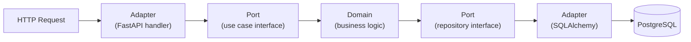

Ogni volta che qualcuno mi chiede "ma tu dove metti le cose?" in un progetto Python, finisco per disegnare lo stesso schema su un foglio. Questa è la versione scritta di quel disegno — con un servizio reale come esempio, le scelte che ho fatto e quelle che rifarei.

## Il problema

L'architettura esagonale (o *ports & adapters*, o *clean architecture* a seconda di chi la racconta) nasce da un'esigenza semplice: il dominio — la logica di business — non dovrebbe sapere nulla di come i dati arrivano o dove vanno. Non sa che esiste HTTP. Non sa che esiste PostgreSQL. Non sa che esiste Kafka.

## La struttura in pratica

Il flusso di una richiesta tipica:



Il dominio vive al centro. Le dipendenze puntano sempre *verso* il dominio, mai *verso* l'esterno.

## Dove metto le cose, concretamente

Nel progetto a cui ho lavorato più a lungo:

```
src/
  domain/
    entities.py        # dataclass / pydantic model, zero import esterni
    services.py        # logica, dipende solo da entities + ports
    ports.py           # ABC/Protocol per repository e servizi esterni
  adapters/
    http/              # FastAPI router, dipende da domain.services
    persistence/       # SQLAlchemy models + repository impl
    external/          # client HTTP verso API terze
  config.py            # wiring delle dipendenze (composition root)
```

## Cosa rifarei

**Usare `Protocol` invece di `ABC`** per le porte. È più leggero, non richiede ereditarietà esplicita, e si integra meglio con mypy in modalità strict.

**Non mixare entity e value object.** Ho scoperto a metà progetto che trattavo come entità oggetti che avrebbero dovuto essere immutabili. Il refactor ha richiesto due sprint.

## Cosa *non* rifarei

Tenere i test di integrazione nella stessa cartella dei test unitari. Sembrava comodo. Non lo era.
